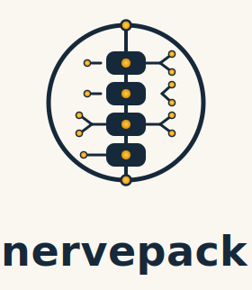

<p align="center"></p>

# nervepack

> **A modpack for AI cognition. Skills, memory, tools, and workflows in one harness.**

nervepack is a context hub you run across your machines: the source of truth for the
skills, rules, and dev-environment setup an AI coding assistant should know about, so a
fresh box and a year-old box behave like the same collaborator. It works with Claude
Code and any other agentic host that can read files and run shell commands.

The reference instance lives at `github.com/pat-browne/nervepack`; fork it and make it
your own.

> **If you're a Claude session, read `CLAUDE.md` first.** It's the agent manual. The
> directory contract, the sync and contribute protocols, and what's off-limits all
> live there.

## The two halves (and an optional third)

nervepack splits into an engine and your content, in two repos.

- **The engine** (this repo) is the reusable machinery. Hooks, crons, the toggle
  system, onboarding, the MCP server, and the generic cognition + workflow skills
  (`np-core-*` / `np-flow-*`). No personal data lives here, and a CI guard keeps it
  that way. Domain and environment skills (`np-kb-*` / `np-env-*`) are content —
  they ship in your overlay, not the engine.
- **Your content** is everything personal the engine reads and writes as you use it.
  Your own skills, your sources and wiki, the memory it accrues, your metrics. It
  lives in a separate overlay repo that the engine finds through `NP_CONTENT_DIR`.

Keeping them apart means the engine can be public and shareable while your content
stays yours. Want to see what an overlay looks like before you build one? The
[`nervepack-content-example`](https://github.com/pat-browne/nervepack-content-example)
repo is a filled-in example with one real file in every layer. Fork it, point the
engine at it, and you're running.

**Working on a team? Add a third overlay.** A team can share a baseline that sits
*above* your personal content. Point at it with `NP_TEAM_DIR` (or write the path into
`~/.config/nervepack/team-dir`) and the stack becomes `team > personal > engine`.
Nested org? Comma-separate up to four team dirs, highest-precedence first
(`squad,division,org` → `squad > division > org > personal > engine`).
Reads merge with the team winning, so a team skill or lesson shadows your personal
one of the same name. Writes still land in your personal overlay, so nothing you
capture bleeds into the team by accident. When you *do* want to publish to the team,
say "save this to the team layer" and contribute targets it explicitly. It stays
dormant until you configure a team dir, and one setting decides how the topic layers
(lessons, episodic, wiki) combine. `team.merge` takes `override`
(default), `concatenate`, or `team-only`.

## How the layers work

Knowledge lives in layers with a strict pecking order:
**`skills > sources > wiki > lessons > episodic`**. **Human-reviewed knowledge
always beats auto-captured knowledge.**

- **Skills** are the curated top layer, the rules and how-to that have been human-reviewed
  and promoted.
  - They load passively on every session.
  - A SessionStart directive is what makes a session actually reach for them instead
    of starting from scratch.
- **Sources + wiki** are the reference layer: version-pinned docs you consult
  repeatedly, plus synthesis pages that cross-link them.
- **Lessons** are auto-distilled from past sessions, both *failures* and *successes*
  — each entry carries a `provenance` tag (`failure` or `success`) so recall can
  frame it right ("avoid X" vs. "the approach that worked is Y"). Provenance is
  independent of enforcement: any lesson, regardless of provenance, can optionally
  carry an `enforce` block that gates the moment you act (a passive skill can't do
  this) — most entries carry none and stay advisory-only.
- **Episodic** is the bottom layer, a prunable narrative of what was worked on and
  where it left off, so a session next week can pick up the thread.

Two pipelines keep the auto layers fed. A **capture** pipeline summarizes each
session into episodic memory and distills its failures/successes into lessons
(tagged by provenance). A **performance** pipeline scores how much nervepack actually
helped and renders it on a dashboard
([see a live example](https://nervepack.app/example/dashboard/), running on synthetic
sample data). Everything is toggle-gated and fails open. No layer can break a session.

The auto layers are a **staging pool**, not a dead end: when a lesson keeps proving
itself (or outgrows what a skill is even allowed to be), the daily maintenance
routine flags it to **graduate** into a real, human-reviewed skill. That's how a
hard-won lesson climbs from "the system noticed this once" to "this is a rule now."

For the full tour (every feature's purpose, the workflow that enforces it, a worked
example of each flow) see [`docs/FEATURES.md`](docs/FEATURES.md).

## Layout

```
CLAUDE.md          # Agent manual. Read this if you're an AI session.
README.md          # You are here.
INDEX.md           # Auto-generated skill index. Read before adding a skill.
docs/
  GETTING-STARTED.md # First-time-user walkthrough: clone → onboard → verify.
  CONTENT-OVERLAY.md # How to configure a personal (and optional team) content overlay.
  ARCHITECTURE.md  # The cheap high-level map. Read before any code change.
  FEATURES.md      # Feature guide: purpose, enforcing workflow, worked example per flow.
  ROADMAP.md       # Deferred work + the trigger to revisit each item.
CONTRIBUTING.md    # How to contribute to the engine.
CHANGELOG.md       # Notable engine changes.
skills/            # The generic engine skills, delivered into every session.
engine/
  setup/           # Idempotent bootstrap, hooks, crons, libs, tests.
  onboard/         # Host-neutral onboarding contract (works beyond Claude Code).
  bin/             # The MCP launcher.
agents/            # Prompts for /schedule, /loop, and the cron agents.
dashboard/         # The performance dashboard (code).
publish/           # The secret/PII guard that keeps personal data out of the engine.
.claude-plugin/    # Plugin manifest for `claude plugin install`.
```

Your content layers (`wiki/` with its co-located sources, `memory/{episodic,lessons}/`,
`dashboard/data/`, your personal skills, design specs) do not live here. They live in
your overlay, and optionally a team overlay above it. See `AGENTS.md` for the full
directory contract and the team-merge rules.

## Host compatibility

nervepack is tool-neutral: it onboards onto any agentic host via the contract in
`engine/onboard/ONBOARD.md`. Maturity varies by host.

| Host | Status | Loads the constitution via | Notes |
|---|---|---|---|
| Claude Code (Linux) | ✅ Proven | `CLAUDE.md`→`@AGENTS.md`; SessionStart hook; skills symlinked | reference implementation |
| Claude Code (macOS) | ✅ Proven | same; launchd not cron | `claude-code-macos` adapter |
| Claude Code (Windows) | 🟡 WIP | same; Task Scheduler not cron; hooks routed through Git-bash | needs Git for Windows; full test suite green on `windows-latest` CI (required check); `claude-code-windows` adapter; end-to-end session validation pending |
| Cursor | 🟡 WIP | `AGENTS.md` native + `.cursor/rules/nervepack.mdc` | new; not yet validated end-to-end |
| Codex CLI | 🟡 WIP | `AGENTS.md` native | contract-compatible; untested |
| Goose | 🟡 WIP | `.goosehints`/recipe; local Ollama or hosted Claude | in progress |
| OpenHands · Cline · Continue · Gemini CLI · Windsurf · Zed · Aider | ⚪ Contract-only | `AGENTS.md` native or capabilities adapter | unvalidated; reports/PRs welcome |

> **Warning.** ✅ Proven = validated end-to-end (`np-doctor` green + a real session). 🟡 WIP /
> ⚪ Contract-only = the wiring/contract exists but has **not** been run end-to-end. Expect
> rough edges, run `engine/setup/np-doctor.sh`, and report gaps. Don't assume feature parity:
> lifecycle capture/evaluator need a session-end event the host may lack.

## Getting started

New to nervepack? **[`docs/GETTING-STARTED.md`](docs/GETTING-STARTED.md)** is the
first-time-user walkthrough: clone the engine, install the toolchain, onboard your
host, point at a content overlay, and verify. It leads with Claude Code; other hosts
follow the same steps via [`engine/onboard/ONBOARD.md`](engine/onboard/ONBOARD.md).

Already onboarded? Check any install with `engine/setup/np-doctor.sh`. Connecting a
non-Claude MCP client instead? See [`engine/onboard/MCP.md`](engine/onboard/MCP.md).

## Continual sync, in one picture

```
  ┌──────────────┐  pull  ┌──────────────┐  symlink   ┌────────────────────┐
  │ origin/main  │ ─────▶ │ ~/Code/      │ ────────▶  │ ~/.claude/skills/  │
  │              │        │   nervepack  │            │                    │
  └──────────────┘        └──────────────┘            └────────────────────┘
         ▲                       │                            │
         │ push                  │ /np-core-contribute        │ loaded into
         │                       ▼                            ▼ every session
  ┌──────────────┐        ┌──────────────────────────────────────┐
  │ scheduled    │ ──────▶│  any AI session, anywhere you work   │
  │ refine agent │        └──────────────────────────────────────┘
  └──────────────┘
```

- **Pull** happens on the `SessionStart` hook (`40-sync-nervepack.sh`) and on demand
  with `/np-core-sync`.
- **Push** happens through `/np-core-contribute` (which asks first) and the
  pre-authorized scheduled-refine agent.

## Why both `skills/` and a `.claude-plugin/`?

Two ways to ship the same content.

- **As user skills**, which is the day-to-day path. `30-link-skills.sh` symlinks each
  `skills/*/SKILL.md` into `~/.claude/skills/`, so they're live in every session with
  no install step.
- **As a plugin**, which is better for sharing. `.claude-plugin/plugin.json` lets
  someone else `claude plugin install` this repo by URL. Same skills, different
  wrapping.

## The maintenance agents

A handful of agents keep the repo healthy so it doesn't rot. Some run as local crons
(they need the local memory store, which the cloud can't reach), some run as cloud
routines. The cadence and the exact prompts live in [`agents/README.md`](agents/README.md),
and `docs/ARCHITECTURE.md` has the authoritative wiring. The short version:

| Agent | Where | Job |
|---|---|---|
| `memory-promote` | Local cron | Triage the local memory store, promote durable entries into the right skill, drop the stale ones. |
| `episodic-maintain` | Local cron | Drain the session inbox into themed episodic memory, compact oversized themes, regenerate the index. |
| `skill-maintain` | Local cron | Keep skill bodies inside budget, splitting overflow into `references/`. |
| `nervepack-refine` | Cloud or local | Lint frontmatter, audit cross-references. |
| `nervepack-compact` | Cloud or local | Dedup near-identical skills, propose splits for the oversized ones. |

They run at staggered times so no two are pushing at once, and everything they write
goes through the same conventions a human would follow. Retired skills move to
`archive/` in your overlay rather than getting deleted, so the history stays readable.

---

<sub>nervepack's coding rules (`np-kb-coding-rules`) adapt Andrej Karpathy's coding
guidelines, and its process workflow is built to compose with the
[superpowers](https://github.com/obra/superpowers) plugin. Full third-party
attribution lives in [`NOTICE`](NOTICE).</sub>
